# Fisexp 4 - Resumo P1

## Experimento 1 - Ótica geométrica

### Conceitos básicos

- **Luz:** onda eletromagnética
- **Espectro de luz visível:** 400nm - 750nm
- **Ótica geométrica:** luz como conjunto de raios que se propagam em linha reta; direção pode ser alterada pela transmissão ou reflexão em superfícies como lentes e espelhos
- **Relação imagem-objeto num espelho esférico:**
  $$
  \frac{1}{o} + \frac{1}{i} = \frac{1}{f} $$
  - $o$ é a distância do objeto à lente
  - $i$ é a distância da imagem à lente
  - $f$ é a distância focal da lente; distância entre a lente e o foco $F$; posição no eixo onde se forma a imagem de objetos muito distantes
  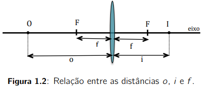

- **Lentes simétricas:** possuem dois focos em posições espelhadas; o foco à esquerda é denominado *foco objeto*; o foco à direita é denominado *foco imagem*; se o objeto estiver à direita da lente, a denominação é invertida
- **Aberração esférica:** denominação dada quando os raios incidentes na lente possuem ângulos grandes (ângulos pequenos = raios paraxiais)
- **Convenção de sinais:**
  - distância objeto $o$ positiva à esquerda da lente
  - distância imagem $i$ positivia à direita da lente
  - distância focal $f$ positiva à direita da lente
  - distância focal de uma lente convergente é positiva e de uma lente divergente, negativa
- **Regra de traço de raios da imagem num ponto do objeto fora do eixo:**
  - Um raio paralelo ao eixo da lente converge para o foco
  - Um raio que passa pelo centro da lente não altera sua direção
  - Um raio que passa pelo foco emerge da lente paralelo ao eixo
- **Lentes convergentes:**
  - **Imagem real:** objeto posicionado antes do foco, pode ser projetada sobre um anteparo, invertida e menor que o objeto
  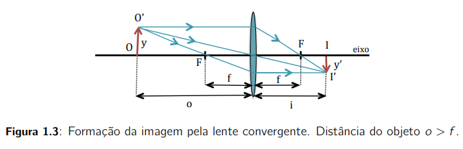
  - **Imagem virtual:** objeto posicionado depois do foco, não invertida e maior que o objeto; imagem formada pelo prolongamento dos raios
  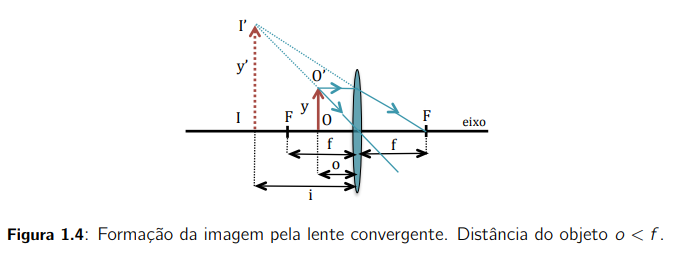
- **Lentes divergentes:** objeto posicionado antes do foco, imagem virtual, não invertida e menor que o objeto, imagem formada pelo prolongamento dos raios
  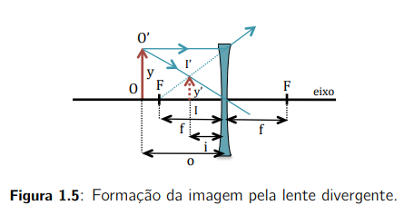
- **Aumento lateral da imagem:**
  $$
  m = \frac{y'}{y} = - \frac{i}{o} $$
  - $m$ pode ser positivo ou negativo
  - $m$ positivo significa uma imagem direta, no mesmo sentido que o objeto
  - $m$ negativo significa uma imagem invertida, no sentido contrário do objeto
  - $|m| > 1$ significa uma imagem *ampliada*
- **Potência da lente:** inverso da sua distância focal, medida em *metros*, chamada de **dioptria**

### Olho humano e defeitos

- Duas lentes: **córnea** (fixa) e **cristalino** (flexível, comporta-se como uma lente convergente)
- Variação do foco do cristalino: **músculos ciliares**
- Diafragma: **íris**, pela abertura **pupila**, controla a luminosidade
- Anteparo: **retina**, onde a imagem real dos objetos é projetada (e transmitida pelo **nervo ótico**)
- **Focalização de objetos distantes:** no infinito, é focalizada na retina quando os músculos ciliares estão totalmente relaxados; a posição $O$ dos objetos é chamada de **ponto distante** $p_d$
  - $p_d$ está localizado no infinito para um olho normal, e na prática, todos os pontos além de $5m$ satisfazem essa condição
- **Focalização de objetos próximos:** contração do músculo ciliar, aumentando a curvatura do cristalino, diminuindo sua distância focal, mantendo a nitidez na retina (**acomodação**)
- **Ponto próximo:** $d_0$ que é em torno de $d_0 \approx 25cm$ para uma visão normal

- **Miopia:** a imagem de objetos localizados no infinito é focalizada antes da retina, corrigida por lentes divergentes
- **Hipermetropia:** a imagem de objetos muito distantes é focalizada depois da retina, sendo corrigida por lentes convergentes
- **Causas:** deofrmação no olho que altera a distância entre a retina e o cristalino, maior no caso da miopia, menor no caso da hipermetropia 
- **Correção da miopia**
  - Objetos localizados no infinito ficam desfocados
  - Objetos menores que $p_d$ estarão próximos por conta da *acomodação*
  - Deve-se usar uma lente divergente para corrigir a miopia
  - **O tamanho aparente dos objetos devem ficar preservados (nítidos mas sem alteração do tamanho na ausência da lente) - escolhe-se adequadamente uma distância entre a lente divergente e o sistema córnea-cristalino**
  - **Devem formar uma imagem virtual não invertida de objetos muito distantes ($> p_d$)**
  - **A imagem virtual será formada nitidamente na retina, mesmo com o nervo ciliar relaxados - escolhe-se uma distância focal da lente divergente de forma adequadamente**
  - O foco da lente divergente $F_D$ deve coincidir com o ponto distante do olho $p_d$, já que raios de objetos distantes ateingem a lente paralelos ao eixo
  - O foco da lente divergente é dado por $f_D = - (p_d - f_C)$ 
  - **Exemplo:** tipicamente, $f_C \approx 16mm$, se $p_d - 2,0m$, a distância focal da lente divergente deverá ser $f_D \approx 1,98m$, o que gera uma potência (inverso da distância focal) igual a $-0,5$, que é o valor do grau de correção do óculos
  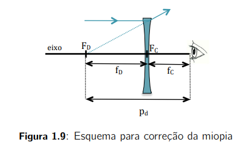

### Instrumentos óticos

- Captam, ampliam ou reduzem imagens de objetos - estudo focado em objetos à pequenas distâncias em relação às distâncias focais envolvidas
- O tamanho aparente de um objeto é maior quanto mais próximo estiver da vista
  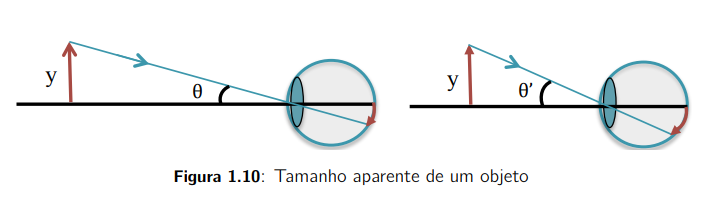

- A medida da dimensão da imagem é dada pelo ângulo visual $\theta$ (ângulo subentendido pelo objeto no olho)
- **Lupa ou microscópio simples:** aumenta-se o tamanho aparente de um objeto com uma lente convergente com posição $o < f$, e a imagem virtual ampliada se situa a uma distância menor que $d_0$
- O novo ângulo visual $\theta$ e a magnificação $M$ são dados por:
  $$
  \begin{align}
    \theta &\approx \arctan \theta = \frac{y}{o} \\
    M &= \frac{\theta}{\theta_0} = \frac{d_o}{o} 
  \end{align}$$ 
  
  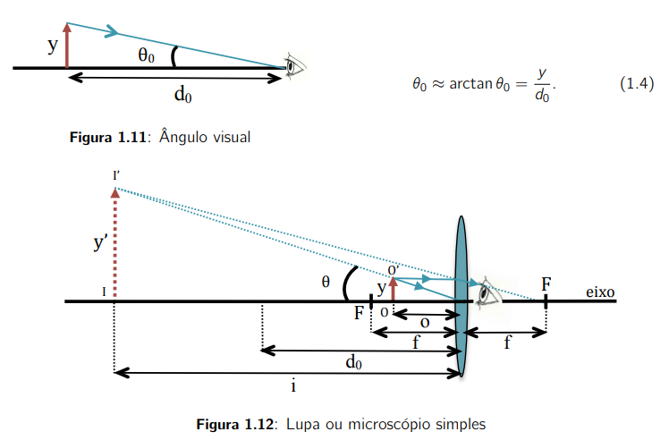

- Se posicionarmos o objeto no foco, teremos a imagem formada no infinito:
  $$
  M = \frac{d_0}{f}$$

- O olho quando relaxado estará focalizado no infinito
- Quanto menor a distância focal $f$, maior a magnificação $M$; porém maior serão as aberrações esféricas

- **Projetor:** produz uma imagem real ampliada de um objeto próximo para ser projetado numa tela, com uma lente convergente e um objeto posicionado em $f < o < 2f$, com imagem indireta (aumento lateral $m$ negativo e $m > 1$)
- A magnificação é calculada como:
  $$m = \frac{y'}{y} = \frac{(f-i)}{f} = - \frac{l}{f}$$
  
  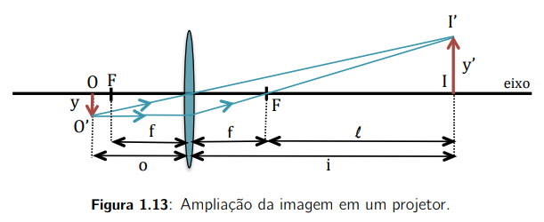

- **Microscópio composto:** usa duas lentes convergentes - uma *objetiva*, realizando o papel de um projetor (imagem real invertida e amplificada), e a outra *ocular*, realizando o papel da lupa (imagem virtual direta e amplificada)
- A magnificação é obtida com a imagem da lente objetiva no plano focal da lente angular
- Os aumentos laterais daas lentes são dadas por:
  $$
  \begin{align}
    m &= - \frac{l}{f_{ob}} \\
    M &= \frac{d_0}{f_{oc}}
  \end{align}$$

- A ampliação total do microscópio $A$ é dada por:
  $$
  A = |mM| = \frac{l d_o}{f_{ob} f_{oc}}$$
  
  - $l$ é aproximadamente o comprimento do tubo do microscópio

  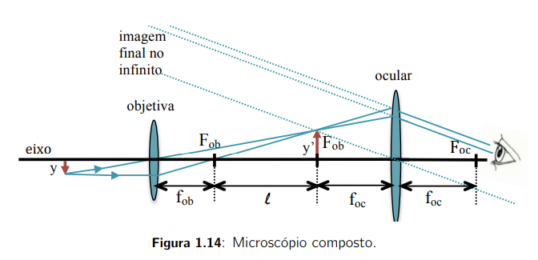

## Experimento 2 - Interferência e difração

- **Ótica ondulatória:** trata a luz como onda e descreve os fenômenos de interferência e difração
- A ótica geométrica explica adequadamente situações onde a luz passa por objetos de dimensão muito maior que o comprimento de onda $\lambda$ da radiação eletromagnética
- **Coerência:** duas ondas são coerentes se existe uma relação de fase constante entre elas
  - Quando se encontram na mesma região do espaço, podem sofrer **interferência construtiva** (soma de amplitudes com mesmo sinal) ou **interferência destrutiva** (soma de amplitudes com sinais contrários)
- Uma lâmpada possui vários emissores de luz independentes, que não interferem entre si; já um laser possui um conjunto de emissores de luz que há uma relação de fase constante

### Difração em uma fenda simples

- **Difração:** ocorre quando uma onda atravessa uma abertura cujas dimensões são próximas do comprimento de onda
- Em uma fenda simples, o perfil de intensidade da luz no anteparo após a fenda é dada por:
  $$
  I(\theta) = I_0 \sin c^2 \left( \frac{\pi a \sin \theta}{\lambda} \right)$$

  - $I_0$ é a intensidade inicial da onda
  - $\sin c$ é o seno cardinal ($\sin c (x) = \sin x/x$), onde $\sin c (0) = 1$; logo quando $\sin x = 0$, a função cardinal se anula para múltiplos de $\pi$, gerando mínimos de difração dados por
  $$
  m \lambda = a \sin \theta_{\text{min}}^{m} ; \ m = \pm 1, \pm 2, \cdots $$
  
  - $m$ é um número inteiro que especifica a ordem do mínimo de difração
  
  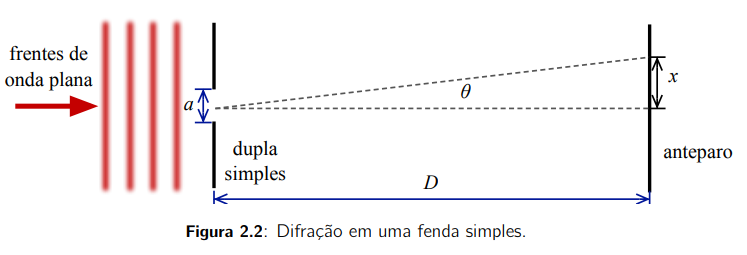
  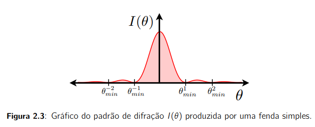

- O ângulo $\theta$ é dado por:
  $$
  \sin \theta = \frac{x}{\sqrt{x^2 + D^2}} \approx \frac{x}{D}, \ x << D $$

- Esse regime de $x << D$ é conhecido como **difração de Fraunhofer**
- Quanto mais confinada a onda no plano da fenda simples ($z=0$ ou plano próximo), mais a onda se alarga no plano do anteparo ($z = D$ ou plano distante); esse alargamento é quantificado pela distância entre os mínimos $m = -1$ e $m = 1$:
  $$
  \Delta \theta = \frac{1}{2} |\sin \theta_{\text{min}}^{+1} - \sin \theta_{\text{min}}^{-1}| = \frac{\lambda}{a} $$
- Podemos também escrever:
  $$
  a \Delta \theta = \lambda $$
- Ou seja, o limite desse produto é dado pelo comprimento de onda de luz

### Interferência em fenda dupla

- Padrão de interferência formado pelas frentes da onda plana passando por uma fenda dupla, chamado de **experimento de Young**
  
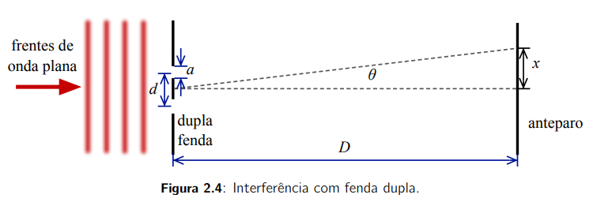

- Padrão de intensidade dado por:
  $$
  I_2(\theta) = I (\theta) \cos^2 \left( \frac{\pi d \sin \theta}{\lambda} \right)  $$

- Possui máximos e mínimos de interferência por conta da função cosseno, com máximos sendo a interferência construtiva e os mínimos, a interferência destrutiva
- Com uma fenda dupla **perpendicular** ao feixe incidente, temos os ângulos dos máximos dados por:

  $$
  \sin \theta_{\text{max}}^{m} = \lambda \frac{m}{d} ; \ m = \pm 1, \pm 2, \cdots $$

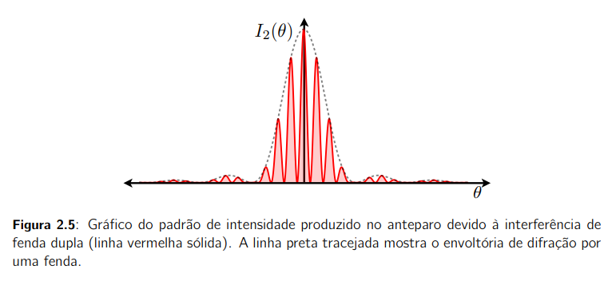

### Rede de difração (interferência de múltiplas ondas)

- Combinam os efeitos de **difração** e de **interferência**
  
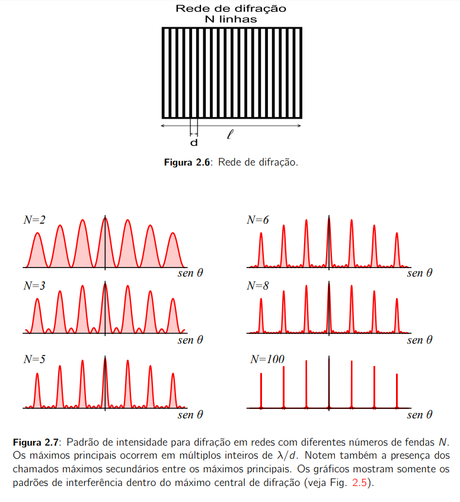

- Os máximos primários se estreitam com um número maior de fendas, a os máximos secundários crescem (mas sua intensidade diminui)
- Sendo a rede de difração $N >> 2$, a largura das fendas é desprezível, falando-se de linhas ao invés de fendas
- As linhas sendo igualmente espaçadas, temos que $N_I \approx 1/d$, onde $d$ é a distância entre linhas
- A posição dos máximos é dada por:
  $$
  \sin \theta_{\text{max}}^m = N_I m \lambda; \ m = 0, \pm 1, \pm 2, \cdots $$

- Esse número pode ser muito grande, fazendo não valer a aproximação de ângulo pequeno, logo temos:
  $$
  \sin \theta = \frac{x}{\sqrt{x^2 + D^2}}$$

- A posição do máximo depende de $N_I$ e do comprimento de onda da luz 

## Experimento 3 - Interferômetro de Michelson

- **Interferômetro de Michelson-Morley**: detecção do "ether" e de ondas gravitacionais
- Usado para calcular com alta precisão a diferença de tempo da propagação da luz em direções perpendiculares
- Se duas ondas são sobrepostas em algum lugar do espaço, com intensidades $I_1$ e $I_2$, a intensidade resultante $I$ será:
  $$
  I = I_1 + I_2 = + 2\sqrt{I_1 I_2} \cos \delta $$

  - $\delta$ é a diferença de fase entre as ondas no ponto do espaço 
  - A intensidade resultante pode ser menor ou maior que a soma das intensidades, devido à interferência
  - A intensidade é máxima quando $\delta = 2m \pi$
  - A intensidade é mínima quando $\delta = (2m + 1) \pi$
  - Se as duas ondas são derivadas de uma fonte comum, com mesmo comprimento de onda e fase, a diferença de fase dependerá da diferença entre os caminhos óticos percorridos por elas:
  $$
  \delta = \frac{2 \pi}{\lambda_0} \Delta \mathbb{L} $$

  - $\lambda_0$ é o comprimento de onda no vácuo das ondas envolvidas 
  - Se uma onda propaga em um meio com índice de refração $n$, a relação entre o caminho ótico e a distância percorrida pela onda é $\mathbb{L} = nL$
  - Quando a diferença de caminhos óticos $\Delta \mathbb{L}$ é um múltiplo de $\lambda_0$, a intensidade resultante na interferência das duas ondas atinge seu máximo; se $\Delta \mathbb{L}$ for um múltiplo impar de $\lambda_0 /2$, a intensidade resultante atinge seu mínimo
  - Se a diferença de caminho variar de $\lambda_0 / 2$, a intensidade resultnte pode passar de seu valor máximo para seu valor mínimo, e vice-versa
  - Divide-se um feixe de luz em dois, permite-se que percorram distâncias diferentes, recombinam-se e observa-se o padrão de interferência resultante
  - Como o comprimento de onda da luz é muito pequeno, observa-se facilmente mudanças pequenas na diferença de caminho ótico na intensidade resultante da interferência

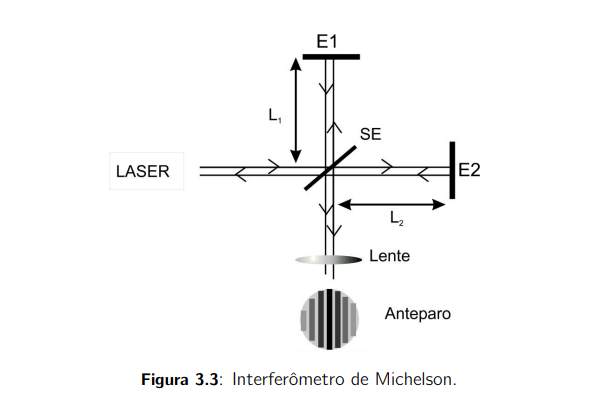

- Uma fonte de luz monocromática (laser) emite um feixe de luz separado em duas partes através de um semi-espelho (SE), que transimete metade do feixe incidente e reflete a outra metade
- O feixe refletido é direcionado a um espelho e retorna em seguida ao semi-espelho, e o mesmo ocorre com o feixe transmitido, recombinando os feixes separados
- As distâncias percorridas pelos feixes em cada um dos braços do interferômetro são $2L_1$ e $2 L_2$
- Uma lente convergente de foco curto é usada para ampliar o padrão de interferência no anteparo
- O padrão de intensidade no anteparo dependerá da diferença de caminhos óticos, $\Delta \mathbb{L} = 2 n (L_1 - L_2)$ entre os feixes recombinados
- $n$ é o índice de refração do meio do interferômetro
- Se a diferença entre caminhos óticos for modificada, mudando os comprimentos dos braços do interferômetro, ou inserindo um material de índice de refração diferente, haverá uma mudança no padrão de intensidade da luz no anteparo 
- Uma variação $\Delta x = \lambda_0 / (4n)$ será uma mudança de $\Delta \mathbb{L} = \lambda_0 / 2$

### Produção de franjas no anteparo

- Se os feixes recombinados forem paralelos, o anteparo será uniformemente iluminado; se os feixes saírem levemente desalinahos (não paralelos), o padrão de iluminação do anteparo será composto de franjas claras e escuras, paralelas
- As franjs se deslocarão como um todo se a diferença de caminhos óticos dos feixes for alterada
- Se a diferença variar de $\lambda_0 / 2$, as franjas claras ocuparão os lugares das franjas escuras, e vice-versa
- Contando o número de franjas que passam por uma certa posição de referência no anteparo, é possível determinar a variação de caminho ótico 

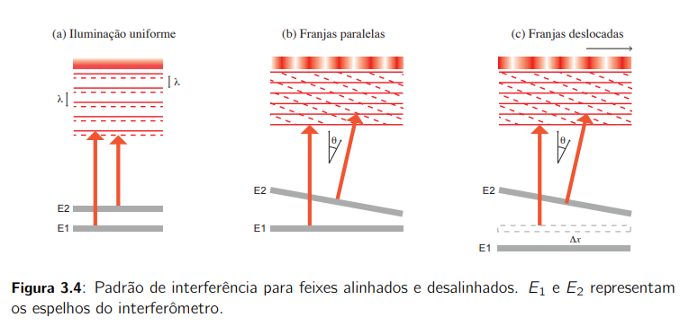

- A distância entre duas franjas claras ou escuras será $\Delta l = \lambda / \sin \theta$
- Quanto mais desalinhados os feixes, mais estreitas serão as franjas de interferência 

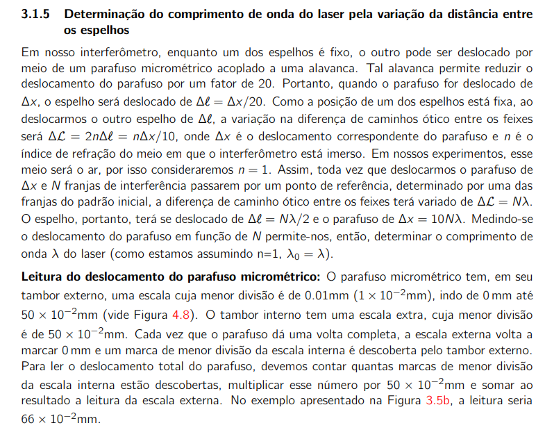

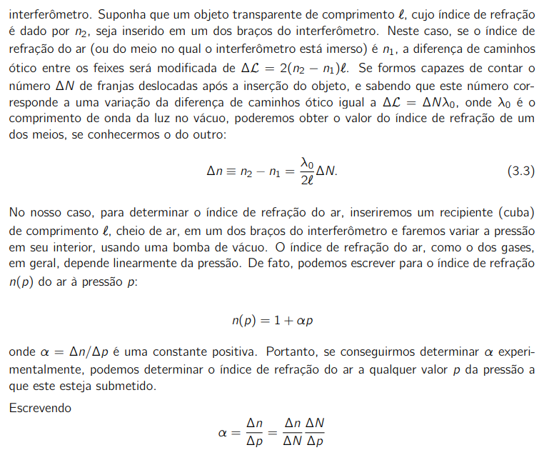

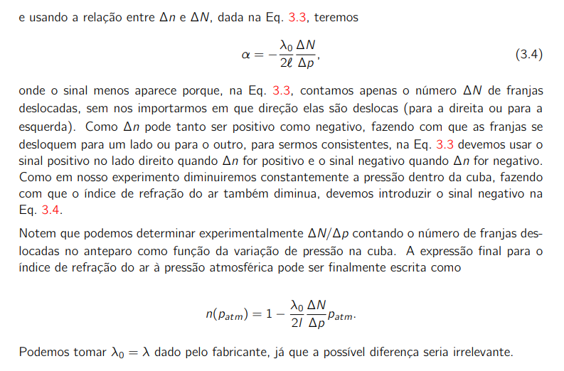