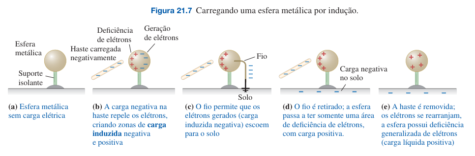
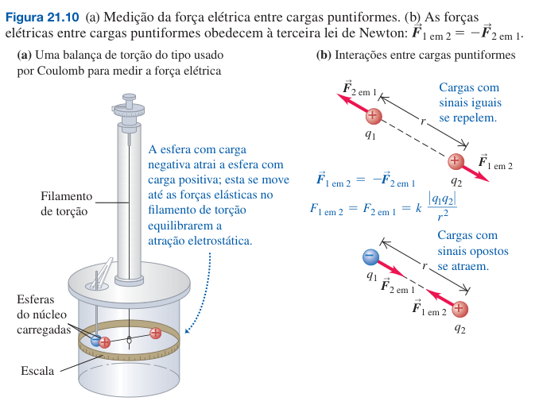

# Carga elétrica e campo elétrico

- Eletromagnetismo, que envolve tanto a eletricidade quanto o magnetismo.
- As interações eletromagnéticas envolvem partículas que possuem carga elétrica.

Tópicos:
- Natureza da carga elétrica
- Quantização da carga elétrica
- Princípio de conservação das cargas elétricas
- Forças eletrostáticas e Lei de Coumlomb
- Campo elétrico

## Carga elétrica

- **Carga elétrica líquida**: objeto adquiriu carga e se tornou carregado
- **Eletrostática**: interações entre cargas elétricas que estão em repouso
- **Tipos de carga elétrica**: positiva e negativa
- **Atração e repulsão de cargas**: Duas cargas positivas ou duas cargas negativas se repelem. Uma carga positiva e uma carga negativa se atraem.
> Cargas similares se repelem no sentido de que possuem sinais algébricos diferentes.
- **Partículas atômicas**:
  - **Próton**: possui carga positiva
  - **Elétron**: possui carga negativa
  - **Nêutron**: não possui carga elétrica
  - **Núcleo**: empacotamento de prótons e nêutrons
- **Número atômico**: o número de prótons ou elétrons existentes num átomo neutro de um elemento
- **Íon**: ausência (positivo) ou excesso (negativo) de elétros num átomo de um elemento. O processo de ganho/perda chama-se *ionização*.

### Conservação da carga elétrica

- **Princípio da conservação da carga elétrica**: A soma algébrica de todas as cargas elétricas existentes em um sistema isolado permanece constante.
- **Quantização da carga elétrica**: O módulo da carga do elétron ou do próton é uma unidade natural de carga elétrica.
$$ Q = n \cdot e \\ e = - 1.6 \times 10^{-19} $$

## Condutores, isolantes e cargas induzidas

- **Condutor**: permite a migração da carga elétrica de uma região do material para a outra
- **Isolante**: não permite ou resiste à migração de cargas elétricas de uma região para outra
- **Semicondutor**: possui propriedades intermediárias entre um condutor e um isolante
- **Carga por induçãao**: um material produz uma carga com sinal oposto em outro corpo, sem que haja perda da sua própria carga
- **Polarização**: deslocamento de cargas das moléculas no interior de um isolante neutro

## Lei de Coumlomb

- **Lei de coulomb**: relaciona a força de interação entre cargas puntiformes de acordo com a magnitude das cargas e sua distância

- **Definição**: O módulo da força elétrica entre duas cargas puntiformes é diretamente proporcional ao produto das cargas e inversamente proporcional ao quadrado da distância entre elas.
$$ F = k \frac{|q_1 q_2|}{r^2} $$
- **Direção da força**: é sempre ao longo da linha reta que passa pelas cargas
- **Constante de proporcionalidade (k)**: em termos de carga elétrica, $k$ é dado por $k = 8,988 \times 10^9 N \cdot m^2 / C^2$  
- **Constante elétrica ($\epsilon_0)$**: escreve-se a constante de proporcionalidade em termos da constante elétrica, podendo escrever a Lei de Coumlomb como:
$$ k = \frac{1}{4 \pi \epsilon_0} \\ F = \frac{1}{4 \pi \epsilon_0} \frac{|q_1 q_2|}{r^2} $$
$$ \epsilon_0 = 8,854 \times 10^{-12} C^2/ N \cdot m^2 \ ; \ \frac{1}{4 \pi \epsilon_0} = k = 8,988 \times 10^9 N \cdot m^2/C^2 $$
- **Princípio de superposição de forças**: a força total exercida sobre uma carga que interage com duas ou mais cargas é dada pela **soma vetorial** das forças que as cargas exercem individualmente.
- Para realizar exercícios com a lei de Coulomb:
  - Essa lei descreve forças elétricas entre partículas carregadas
  - Montar um sistema de corpos livres com coordenadas
  - Identificar partículas e forças elétricas atuantes nestas
  - Calcular o módulo e os vetores da força elétrica nas partículas de interesse
  - Lembre-se que a força é exercida por uma partícula sobre outra partícula
  - Utilizar o princípio da superposição sobre cada partícula
  - Simetrias simplificam os problemas
  - Alguns exemplos são de distribuições contínuas de cargas (ao invés de uma partícula), logo a soma vetorial da superposição de forças se torna uma integral vetorial.
  
### Exemplo 1
> Uma partícula a (o núcleo do átomo de hélio) possui massa $m = 6,64 \cdot 10^{-27} kg$ e carga $q = +2e = 3,2 \cdot 10^{-19} C$. Compare o módulo da força de repulsão elétrica entre duas partículas $\alpha$ (“alfa”) com o módulo da força de atração gravitacional entre elas.

  $$
  \begin{align}
  F_e &= \frac{1}{4 \pi \epsilon_0} \frac{q^2}{r^2} \ ; \ F_g = G \frac{m^2}{r^2} \\
  \frac{F_e}{F_g} &= \frac{1}{4 \pi \epsilon_0 G} \frac{q^2}{m^2} \ ;  \ \left( \frac{1}{4 \pi \epsilon_0} = 9,0 \times 10^9 N \cdot m^2/C^2   \right)  \\
  &=  \frac{9,0 \times 10^9 N \cdot m^2/C^2}{6,67 \times 10^{-11} N \cdot m^2 / kg^2} \frac{(3,2 \times 10^{-19}C)^2}{(6,64 \times 10^{-27} kg)^2} \\
  &= 3,1 \times 10^{35}
  \end{align}$$
  - No final, é uma relação de proporcionalidade entre forças, então como forças possuem a mesma unidade, o resultado é adimensional (a proporção numérica da razão entre elas)
  - Pode-se observar como a força elétrica é muito maior que a força gravitacional e a força de repulsão elétrica entre as partículas $\alpha$ é muito maior para interações entre partículas atômicas e subatômicas.

### Exemplo 2
> Duas cargas puntiformes, $q_1 = +25nC$ e $q_2 = - 75 nC$ estão separadas por uma distância $r = 3,0 cm$. Determine o módulo e o sentido da força elétrica que $q_1$ exerce sobre $q_2$ e vice-versa.

  $$
  \begin{align}
  F_{12} &= \frac{1}{4 \pi \epsilon_0} \frac{|q_1 q_2|}{r^2} \\
  &= (9,0 \cdot 10^9 N \cdot m^2 / C^2) \frac{|(+25 \cdot 10^{-9} C) (-75 \cdot 10^{-9} C)|}{(3 \cdot 10^{-2})^2} \\
  &= (9,0 \cdot 10^9 N \cdot m^2 / C^2) \frac{1875 \cdot 10^{-18}}{9 \cdot 10^{-4}} \\
  &= 1875 \cdot 10^{-5} = 0,01875 \ N
  \end{align}$$
  - As partículas se atraem por possuirem cargas opostas, logo o sentido do vetor da partícula vai apontar para a partícula que está exercendo a força.
  - Como $F_{12}$ será calculada da mesma forma que $F_{21}$, o módulo da força resultante em cada partícula será igual, mas de sentidos opostos.

### Exemplo 3
> Duas cargas puntiformes estão localizadas no eixo x de um sistema de coordenadas; $q_1 = 1,0 nC$ em $x = +2,0 cm$ e $q_2 = -3,0 nC$ em $x = +4,0 cm$. Qual a força elétric total exercida por $q_1$ e $q_2$ numa carga $q_3 = 5,0 nC$ em $x = 0$?

  $$
  \begin{align}
    F_{13} &= \frac{1}{4 \pi \epsilon_0} \frac{|q_1 q_3|}{r_{13}^2} \\
    &= (9,0 \cdot 10^9 N \cdot m^2 / C^2) \frac{|(1 \cdot 10^{-9}) (5 \cdot 10^{-9}C)|}{(2 \cdot 10^{-2})^2} \\
    &= 11,25 \cdot 10^{-5} = 112,5 \mu N \\
    F_{23} &= \frac{1}{4 \pi \epsilon_0} \frac{|q_2 q_3|}{r_{23}^2} \\
    &= (9,0 \cdot 10^9 N \cdot m^2 / C^2) \frac{|(-3 \cdot 10^{-9}) (5 \cdot 10^{-9}C)|}{(4 \cdot 10^{-2})^2} \\
    &= 8,438 \cdot 10^{-5} = 84,38 \mu N \\
    \vec{F_3} &= \vec{F_{13}} + \vec{F_{23}} \\
    &= (-112 \mu N) \hat{i} \ + \ (84 \mu N) \hat{i} \\
    &= (-28 \mu N) \hat{i}  
  \end{align}$$
  - Pela superposição de forças, podemos observar que $F_{13}$ é maior que $F_{23}$, o que gera a força resultante no mesmo sentido que $F_{13}$ (sentido de $-x$).

### Exemplo 4
$$
\begin{align}
  q_1 &= 2,0 \mu C, \ x = 0, \ y= 0,30m \\
  q_2 &= 2,0 \mu C, \ x = 0, \ y = -0,30m \\
  Q &= 4,0 \mu C, \ x = 0,40m, \ y = 0 \\
  \vec{F_Q} &= \ ?
\end{align}$$
$$
\begin{align}
  F_{1Q} &= F_{2Q} \ ; \ d = \sqrt{x^2 + y^2} = \sqrt{0,30^2 + 0,40^2} = 0,50m \\
  F_{1Q} &= (9,0 \cdot 10^9 N \cdot m^2 / C^2) \frac{(4,0 \cdot 10^{-6} C) (2,0 \cdot 10^{-6} C)}{(0,50m)^2} \\
  &= 288 \cdot 10^{-3} = 0,29 N \\
  F_{1Q_{x}} &= F_{1Q} \cos \theta = (0,29N) \cdot \frac{0,40m}{0,50m} = (0,23N)\hat{i}  
\end{align}$$
- Por simetria, pode-se observar que a força resultante estará paralela e coincidente ao eixo $x$. Isso só acontece pelo fato de $|q_1| = |q_2|$ e estas estarem simetricamente posicionadas no eixo $y$.

## Campo elétrico e forças elétricas

> Como duas cargas elétricas percebem a existência da outra numa interação (e.g. no vácuo)?

- **Campo elétrico**: o modelo assume que um corpo carregado modifica as propriedades elétricas do espaço ao redor dele, gerando forças em outras partículas em resposta ao ***campo elétrico*** produzido pela partícula carregada num ponto qualquer do espaço. A ***força elétrica*** sobre um corpo carregado é exercida pelo campo elétrico produzido por *outros* corpos carregados. O campo elétrico é uma grandeza vetorial, que não depende da carga do corpo sobre o qual a força elétrica está atuando.
- **Carga de teste**: é uma carga que sofre a ação de uma força elétrica caso exista um campo elétrico no ponto do espaço na qual a carga de teste se localiza.
  
  $$
  \vec{E} = \frac{\vec{F_0}}{q_0}$$
  - $\vec{E}$: campo elétrico (força elétrica por unidade de carga). A unidade SI é $N/C$.
  - $\vec{F}$: força elétrica sobre uma carga de teste $q_0$ em função de outras cargas
  - $q_0$: valor da carga de teste (pode ser positiva ou negativa) 
- **Sentido da força no campo**: se a carga de teste for positiva, a força que atua sobre a carga terá o mesmo sentido do campo elétrico; se for negativa, a força e o campo terão sentidos opostos.
- **Cargas puntiformes**: a equação $\vec{F_0} = q_0 \vec{E}$ somenete se aplica a cargas de teste puntiformes; o campo elétrico pode assumir diferentes valores em pontos diferentes; quando o corpo carregado possui um tamanho suficientemente grande, a determinação da força elétrica resultante pode ser mais complexa para campos elétricos variáveis.

### Campo elétrico de uma carga puntiforme

- **Ponto da fonte**
- **Ponto do campo**
- **Vetor unitário**
- **Módulo da força $F_0$**

$$
\begin{align}
  F_0 = \frac{1}{4 \pi \epsilon_0} \frac{|q\cdot q_0|}{r^2}
\end{align}$$

$$
E = \frac{1}{4 \pi \epsilon_0} \frac{|q|}{r^2}$$

- **Equação vetorial do campo elétrico de uma carga puntiforme**

$$
\vec{E} = \frac{1}{4 \pi \epsilon_0} \frac{q}{r^2} \hat{r}$$

- **Direção do campo elétrico de uma carga puniforme**
- **Campo elétrico uniforme**
- **Campo elétrico dentro de um condutor**
- **Análise da interação eletrosteática**

- Calcule o módulo do campo elétrico de uma carga puntiforme
$q = 4,0 nC$ em um ponto do campo situado a uma distância de
$2,0 m$ da carga.

  - Usando a lei de coulomb e a definição de campo elétrico, temos que, para o módulo do campo elétrico:

  $$
  \begin{align}
    F_0 &= \frac{1}{4 \pi \epsilon_0} \frac{|q q_0|}{r^2} \\
    E &= \frac{F_0}{q_0} \\
    &= \frac{\frac{1}{4 \pi \epsilon_0} \frac{|q q_0|}{r^2}}{q_0} \\
    &= \frac{1}{4 \pi \epsilon_0} \frac{|q|}{r^2} , \ (q = 4,0 nC, \ r = 2,0m) \\
    &= (9,0 \cdot 10^9 N \cdot m^2 / C^2) \cdot \frac{4,0 \cdot 10^{-9} C}{(2,0 m)^2} \\
    &= 9,0 \ \text{N/C}
  \end{align}$$

- Uma carga puntiforme $q = - 8,0 nC$ está localizada na origem. Determine o vetor do campo elétrico para o ponto do campo $x = 1,2 m$, $y = -1,6 m$.

  - Calculamos o módulo do vetor $r$ para aquele ponto do campo elétrico
  - Calculamos o vetor unitário
  - Calculamos o vetor campo elétrico

  $$
  \begin{align}
    r &= \sqrt{x^2 + y^2} \\
    &= \sqrt{(1,2m)^2 + (-1,6m)^2} = 2,0m \\
    \hat{r} &= \frac{\vec{r}}{r} = \frac{x \hat{i} + y \hat{j}}{r} \\
    &= \frac{(1,2 m) \hat{i} + (-1,6m) \hat{j}}{2,0 m} \\
    &= 0,60 \hat{i} - 0,80 \hat{j} \\
    \vec{E} &= \frac{1}{4 \pi \epsilon_0} \frac{q}{r^2} \hat{r} \\
    &= (9,0 \cdot 10^9 N \cdot m^2/C^2) \cdot \frac{-8,0 \cdot 10^{-9} C}{(2,0m)^2} \cdot (0,60 \hat{i} - 0,80 \hat{j}) \\
    &= 16,0 \text{N/C} \cdot (0,60 \hat{i} - 0,80 \hat{j}) \\
    &= (-11 \text{N/C}) \hat{i} + (14 \text{N/C})\hat{j}
  \end{align}$$

  - Como a carga é negativa, o vetor campo elétrico aponta do ponto do campo para a carga (ponto da fonte), com seintodo oposto ao vetor unitário $\hat{r}$.
  - Se formos calcular o módulo e direção do campo elétrico para essa carga, teremos:

  $$
  \begin{align}
    E &= \frac{1}{4 \pi \epsilon_0} \frac{|q|}{r^2} \\
    &= (9,0 \cdot 10^9 N m^2/C^2) \cdot \frac{|-8,0 \cdot 10^{-9} C|}{(2,0m)^2} \\
    &= 18 \text{N/C} \\
    \hat{E} &= - \hat{r} \\
    &= -0,60 \hat{i} + 0,80 \hat{j}
  \end{align}$$

  - Ou, para calcularmos a direção do campo elétrico, podemos usar a equação para as distâncias $x_i = x - x_0, \ y_i = y - y_0$

- Quando os terminais de uma bateria são conectados a duas placas condutoras paralelas separadas por um vão pequeno, as cargas resultantes sobre as placas produzem um campo elétrico aproximadamente uniforme na região entre as placas. (Na próxima seção, mostraremos por que isso acontece.) Se as placas estão separadas por uma distância de $1,0 cm$ conectadas a uma bateria de $100 V$, como indica a Figura 21.20, o campo está orientado verticalmente de baixo para cima e seu módulo é dado por $E = 1,00 \cdot 10^4 N/C$. (a) Calcule a aceleração de um elétron (carga $-e = -1,60 \cdot 10^{-9} C$, massa $m = 9,11 \cdot 10^{-31} kg$ liberado do repouso na placa superior. (b) Calcule o módulo da velocidade e a energia cinética do elétron adquiridos ao longo do trecho de $1 cm$ até a placa inferior. (c) Quanto tempo ele leva para percorrer essa distância?

  - Calculamos a força exercida no elétron submetido ao campo elétrico uniforme, e depois calculamos a sua aceleração
  - Calculamos a energia cinética do elétron utilizando sua velocidade, e podemos considerar a velocidade inicial como a mesma se o elétron estivesse em repouso (o movimento é relativo)
  - Calculmos a velocidade pela equação de aceleração

  $$
  \begin{align}
    E &= \frac{F_0}{q_0} \Rightarrow F_0 = q_0 E \\
    a_y &= \frac{F_y}{m} = \frac{-e E}{m} \\
    &= \frac{(-1,60 \cdot 10^{-19} C) (1,00 \cdot 10^4 N/C)}{9,11 \cdot 10^{-31} kg} \\
    &= -1,76 \cdot 10^{15} m/s^2
  \end{align}$$

  - Considerando $v_{0y} = 0$ e $y_0 = 0$, temos:

  $$
  \begin{align}
    v_y^2 &= v_{0y}^2 + 2 a_y (y - y_0) \\
    |v_y| &= \sqrt{2 a_y y} \\
    &= \sqrt{2 (-1,76 \cdot 10^{15} \ m/s^2) (-1,0 \cdot 10^{-2} \ m)} \\
    &= 5,9 \cdot 10^{6} \ m/s \\
    K &= \frac{1}{2} mv^2 \\
    &= \frac{1}{2} (9,11 \cdot 10^{-31} kg) (5,9 \cdot 10^6 m/s)^2 \\
    &= 1,6 \cdot 10^{-17} \ J
  \end{align}$$

  - Considerando $t_0 = 0$ (aceleração constante), temos:

  $$
  \begin{align}
    a_y &= \frac{v_y - v_{0y}}{t - t_0} \rightarrow t = \frac{v_y - v_{0y}}{a_y} \\ 
    t &= \frac{(-5,9 \cdot 10^6 m/s) - (0 m/s)}{-1,76 \cdot 10^{15} m/s^2} \\
    &= 3,4 \cdot 10^{-9} s
  \end{align}$$