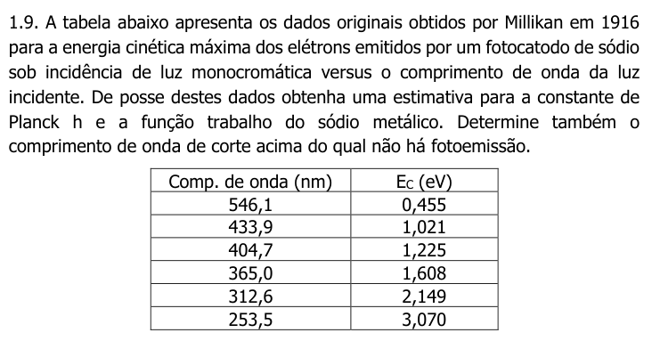
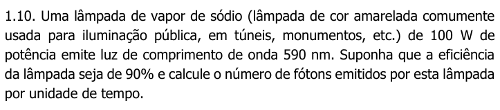
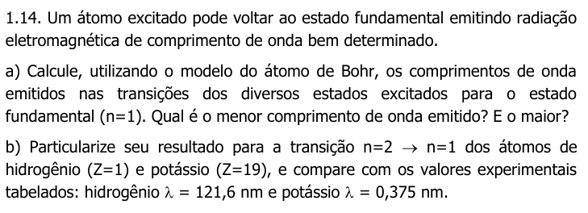
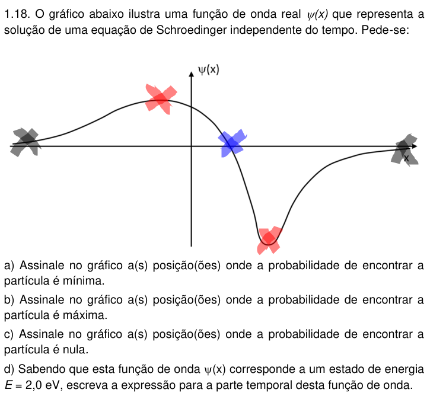
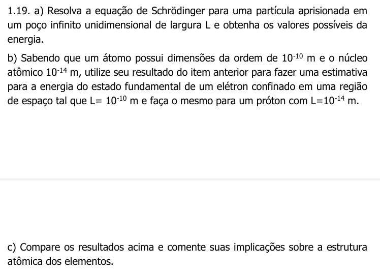
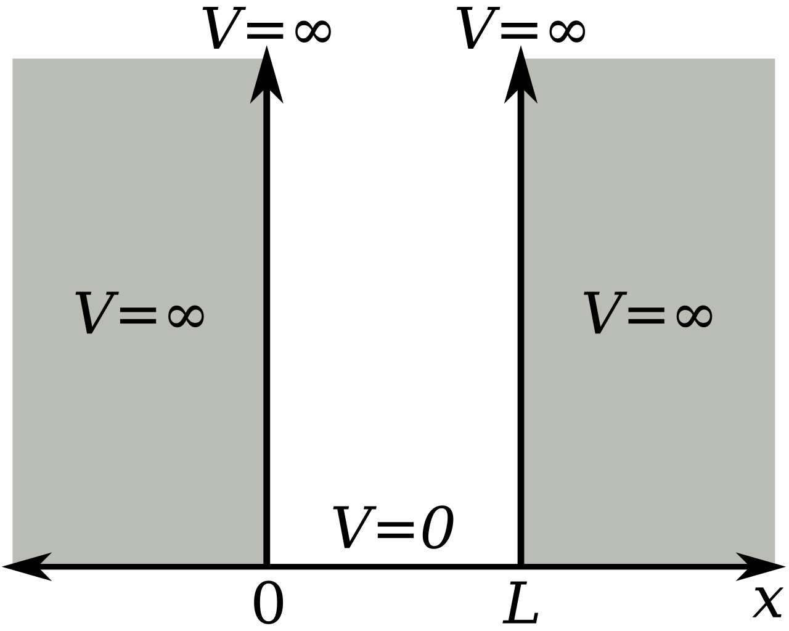

# Lista 1 de exercícios

## Questão 9

Considerando $K_{\text{max}} = hf - \phi$, o coeficiente linear é $h$, logo podemos estimar a constante de Planck ao linearizar a função gerada por esses pontos.

$$
\begin{align}
    m &= \frac{\Delta y}{\Delta x} \\
    &= \frac{3,070 - 0,455}{(\frac{300.000.000}{253,5 \times 10^{-9}}) - (\frac{300.000.000}{546,1 \times 10^{-9}}) } \\
    &= 4,15 \times 10^{-15} \\
    y &= mx + b \\
    b &= y - mx \\
    &= 3,070 - 4,15 \times 10^{-15} \cdot (\frac{300.000.000}{253,5 \times 10^{-9}}) \\
    &= 3,070 - 4,920 = -1.85
\end{align}$$

$\lambda$ de corte:

$$
\begin{align}
    E_c &= 0 \rightarrow y = 0 \\
    \log f &= \frac{1,85}{4 \cdot 10^{-15}} \\
    &= 4,45 \times 10^{14} Hz
\end{align}$$

$$
\begin{align}
    \lambda &= \frac{c}{f} = \frac{c}{\nu} \\
    &= \frac{3\cdot 10^{8}}{4,45 \cdot 10^{14}} \\
    &= 6,74 \times 10^{-7} \rightarrow \lambda = 674 \ nm
\end{align}$$

Função trabalho:

$$\begin{align}
    K_c &= hf - \phi \\
    K_c &= 0 \rightarrow \phi = hf = 1,85
\end{align}$$

## Questão 10

$$
\begin{align}
    P &= \frac{E}{\Delta T} \\
    P &= V \cdot I \\
    &= E \cdot \frac{dQ}{dt} \\
    E &= \frac{hc}{\lambda} \\  
\end{align}$$

$$
\begin{align}
    P &= 0,9 \cdot 100W \\
    \frac{dQ}{dt} &= 90 \cdot \frac{\lambda}{hc} \\
    &= \frac{90 \cdot 590 \cdot 10^{-9}}{6,63 \cdot 10^{-34} \times 3 \cdot 10^{8}} \\
    &= 2,67 \cdot 10^{20} \ C/s
\end{align}$$

## Questão 14

### letra a)

$$
\begin{align}
    E_n &= - \frac{m \cdot e^4 \cdot Z^2}{8 \cdot h^2 \cdot \epsilon_0^2} \cdot \frac{1}{n^2} = - E_0 \cdot \frac{Z^2}{n^2} \ (E_0 = 13,6 eV) \\
    \Delta E &= \frac{hc}{\lambda} \rightarrow \lambda = \frac{hc}{\Delta E} \ (hc = 1,989 \times 10^{-25}) \\
    2 \rightarrow 1 \Rightarrow \Delta E &= E_2 - E_1 \\
    &= -E_0 \left( \frac{Z^2}{2^2} - \frac{Z^2}{1^2} \right) \\
    &= -13,6 eV \cdot (1,6 \times 10^{-19}) \cdot \left( \frac{-3 Z^2}{4} \right) \\
    &= 1,63 \times 10^{-18} \cdot Z^2 \ J \\
    \lambda &= \frac{6,63 \cdot 10^{-34} \times 3 \cdot 10^8}{1,63 \cdot 10^{-18} Z^2} = \frac{1,22 \cdot 10^{-7}}{Z^2} m 
\end{align}$$

$$
\begin{align}
    3 \rightarrow 1 \Rightarrow \Delta E &= E_3 - E_1 \\
    &= -E_0 \left( \frac{Z^2}{3^2} - \frac{Z^2}{1^2} \right) \\
    &= -13,6 eV \cdot (1,6 \times 10^{-19}) \cdot \left( \frac{-8 Z^2}{9} \right) \\
    &= 1,93 \times 10^{-18} \cdot Z^2 \ J \\
    \lambda &= \frac{6,63 \cdot 10^{-34} \times 3 \cdot 10^8}{1,93 \cdot 10^{-18} Z^2} = \frac{1,03 \cdot 10^{-7}}{Z^2} m 
\end{align}$$

Quanto maior o $\Delta E$, menor o $\lambda$.

### letra b)

- Hidrogênio ($Z = 1$), $n = 2 \rightarrow 1$

$$
\begin{align}
    \lambda &= \frac{6,63 \cdot 10^{-34} \times 3 \cdot 10^8}{1,63 \cdot 10^18 \times Z^2} \\
    &= \frac{1,22 \cdot 10^{-7}}{1} \ m = 122 \ nm
\end{align}$$

- Potássio ($Z = 19$)

$$
\begin{align}
    \lambda &= \frac{1,22 \times 10^{-7}}{19^2} \\
    &= 3,38 \times 10^{-10} \ m = 0,338 \ nm
\end{align}$$

Os valores calculados são muito próximos aos experimentais.

## Questão 18

Considerando a solução da equação de Schrödinger (função de onda) e que o quadrado da função de onda é a função de probabilidade:

$$
\begin{align}
    \Psi (x) &= A \sin \left( \frac{n \pi}{L} x \right) \\
    |\Psi (x)|^2 &= A^2 \sin^2 \left( \frac{n \pi}{L} x \right) 
\end{align}$$

a) A probabilidade mínima de encontrar a partícula é nos zeros da função, onde está marcado com a cor preta
b) A probabilidade máxima, considerando que $|\Psi (x)|^2 \geq 0$, é onde está marcado com a cor vermelha (máximo e mínimo da função de onda)
c) A probabilidade nula é onde a curva da função de onda tem sua inclinação máxima e cruza o eixo $x$, onde está marcado em azul

### letra d)

$$
\begin{align}
    \Psi (x,t) &= \Psi (x) \cdot \exp (-i \ \omega t) \ , \ \omega = \frac{E}{\hbar} \\
    &= \Psi (x) \cdot \exp \left(-i \ \frac{2,0}{\hbar} t \right)
\end{align}$$

## Questão 19

### letra a)

Equação independente do tempo para uma dimensão:

$$
\begin{align}
    - \frac{\hbar^2}{2m} \frac{d^2 \Psi (x)}{dx^2} + V(x) \Psi (x) = E \Psi (x) 
\end{align}$$

Para o poço infinito, temos que:

$$
\begin{align}
    V (x) &= 0 \ ; \ 0 < x < l \\
    V(x) &= \infty \ ; \ x \leq 0, x \geq L
\end{align}$$

Logo, temos duas análises. Fora do poço, temos que:

$$
\begin{align}
    V &= \infty \\
    - \frac{\hbar^2}{2m} \frac{d^2 \Psi}{dx^2} + V \Psi &= E \Psi \Rightarrow \Psi = 0 
\end{align}$$

Dentro do poço, temos:

$$
\begin{align}
    V &= 0 \\
    - \frac{\hbar^2}{2m} \frac{d^2 \Psi}{dx^2} &= E \Psi \\
    \Psi &= A \sin (k x) + B \cos (kx) \\
    - \frac{\hbar^2}{2m} [- A k^2 \sin (k x) - B k^2 \cos (kx)] &= E \Psi \\
    + \frac{\hbar^2 k^2}{2m} [A \sin (kx) + B \cos (kx)] &= E \Psi \\
    E & = \frac{\hbar^2 k^2}{2m}
\end{align}$$

Com as condições de contorno $\Psi = 0 \rightarrow x = 0$ e $\Psi = 0 \rightarrow x = L$:

$$
\begin{align}
    \Psi (0) &= A \sin 0 - B \cos 0 \ (B = 0) \\
    \Psi (L) &= A \sin k L = 0 \\
    \sin kL &= 0 \Rightarrow kL = n \pi \\
    k_n &= n \frac{\pi}{L}, \ n = 1, 2, 3, \cdots
\end{align}$$

Com a quantização do número de onda ou do momento linear, temos:

$$
\begin{align}
    p &= \frac{h}{\lambda} \\
    \lambda &= \frac{2\pi}{k} \\
    E &\propto k^2 \\
    E_n &= \frac{\hbar^2 \pi^2}{2mL^2} n^2 
\end{align}$$

Portanto, para diferentes níveis de energia, temos:

$$
\begin{align}
    E_1 &= \frac{\hbar^2 \pi^2}{2mL^2} n^2, \ n=1 \\
    &= \frac{(1,055 \times 10^{-34})^2 \cdot \pi^2 \cdot 1^2}{2 \cdot m \cdot L^2} = \frac{5,49 \times 10^{-68}}{m \cdot L^2} \ J \\
    E_2 &= \frac{5,49 \times 10^{-68}}{m \cdot L^2} \times 2^2 = \frac{2,19 \times 10^{-67}}{m \cdot L^2} \ J \\
    E_3 &= \frac{5,49 \times 10^{-68}}{m \cdot L^2} \times 3^2 = \frac{4,94 \times 10^{-67}}{m \cdot L^2} J \\
    E_4 &= \frac{5,49 \times 10^{-68}}{m \cdot L^2} \times 4^2 = \frac{8,79 \times 10^{67}}{m \cdot L^2} J
\end{align}$$

### letra b)

Para o elétron, com massa $9,11 \times 10^{-31} kg$:

$$
\begin{align}
    E_1 &= \frac{\hbar^2 \pi^2}{2mL^2} n^2, \ n=1 \\
    &= \frac{5,49 \times 10^{-68}}{m \cdot L^2} \ J \\
    &= \frac{5,49 \times 10^{-68}}{(9,11 \cdot 10^{-31}) \cdot (10^{-10})^2} \\
    &= \frac{5,49 \times 10^{-68}}{9,11 \times 10^{-51}} \\
    &= 6,02 \times 10^{-18} \ J
\end{align}$$

Para o próton, com massa $1,63 \times 10^{-27} kg$, temos:

$$
\begin{align}
    E_1 &= \frac{\hbar^2 \pi^2}{2mL^2} n^2, \ n=1 \\
    &= \frac{5,49 \times 10^{-68}}{m \cdot L^2} J \\
    &= \frac{5,49 \times 10^{-68}}{(1,63 \cdot 10^{-27}) \cdot (10^{-14})^2} \\
    &= \frac{5,49 \times 10^{-68}}{1,63 \times 10^{-55}} \\
    &= 3,37 \times 10^{-13} \ J
\end{align}$$

### letra c)

A energia do próton é maior que a do elétron, logo o núcleo possui mais energia que a eletrosfera. É o esperado com a magnitude da massa e por apresentar ligações mais fortes.

## Questão 21

$$
\begin{align}
    E &= \frac{\hbar^2 \pi^2 1^2}{2 \cdot (9,11 \cdot 10^{-31}) \cdot (10^{-8})^2} \\ 
    &= \frac{(1.055 \times 10^{-34})^2 \cdot \pi^2}{2 \cdot (9,11 \cdot 10^{-31}) \cdot (10^{-8})^2} \\
    &= \frac{1,11 \times 10^{-68}}{1,822 \times 10^{-46}} \\
    &= 6,10 \times 10^{-23} J \\
    E_c &= \frac{m v^2}{2} \\
    v^2 &= \frac{2 \cdot 6,10 \cdot 10^{-23}}{9,11 \times 10^{-31}} = 1,34 \times 10^{8} \ m/s
\end{align}$$

## Questão 22
