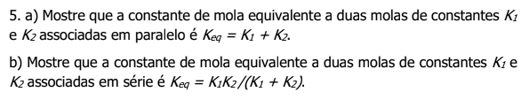
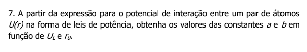
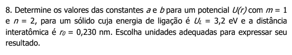

# Lista 2

## Questão 1

$$
\begin{align}
    B &= - V \cdot \frac{\partial P}{\partial V}; \ B = \frac{Y}{3 (1 - 2 \nu)} \\
\end{align}$$

Se tratando da variação de volume em um sólido, temos que:

$$
\begin{align}
    \frac{\partial P}{\partial V} &= \frac{\Delta P}{\Delta V} \\
    - V \cdot \frac{\Delta P}{\Delta V} &= \frac{Y}{3(1 - 2 \nu)} \\
    \frac{-\Delta P}{\frac{\Delta V}{V}} &= \frac{Y}{3(1 - 2 \nu)} \\
    Y \cdot \frac{\Delta V}{V} &= - 3 \Delta P (1 - 2 \nu) \\
    \Delta V &= \frac{-3V \Delta P (1 - 2 \nu)}{Y}
\end{align}$$

Para não existir variação, temos que $\Delta V = 0$, logo apenas o termo $1 - 2 \nu$ pode ser igual a zero, portanto:

$$
\begin{align}
    1 - 2 \nu &= 0 \\
    \nu &= \frac{1}{2} 
\end{align}$$

## Questão 2

Pelo mesmo motivo demonstrado na primeira questão, temos que:

$$
\begin{align}
    \Delta V &= 0  \Rightarrow 1 - 2 \nu = 0 \\
    \nu &= \frac{1}{2} 
\end{align}$$

## Questão 4

A relação entre o módulo de elasticidade, o módulo de compressão e a razão de Poisson é:

$$
\begin{align}
    \frac{Y}{3B} &= (1 - 2 \nu) \\
    Y &= 3B (1 - 2 \nu) \\
\end{align}$$

A relação entre o módulo de elasticidade, o módulo de rigidez e a razão de Poisson é:

$$
\begin{align}
    \frac{Y}{2G} &= (1+ \nu) \\
    Y &= 2G (1 + \nu) \\
\end{align}$$

Comparando ambas, temos:

$$
\begin{align}
    3B (1 - 2 \nu) &= 2G (1+ \nu) \\
    (1 - 2 \nu) &= \frac{2G}{3B} (1+ \nu)
\end{align}$$

Par valores negativos da razão de Poisson, temos que:

$$
\begin{align}
    1 - 2 \nu &> 0 \\
    \frac{2G}{3B} (1 + \nu) &> 0 \\
    1 + \nu &> 0 \\
    - \nu < 1 \\
    \nu < -1 \\
    \nu_{min} &= -1
\end{align}$$

## Questão 5

Para duas molas em paralelo, ambas as molas estão conectadas por suas extremidades, logo qualquer distância na qual uma mola for comprimida, a outra também será. Logo temos:

$$
\begin{align}
    F &= F_1 + F_2 \\
    &= -k_1 x - k_2 x \\
    F &= - (k_1 + k_2) x \\
    k_{eq} &= k_1 + k_2
\end{align}$$

Para duas molas conectadas em série, temos que a deformação total será igual a soma das deformações de ambas as molas, e ambas as molas irão sofrer a mesma força, logo:

$$
\begin{align}
    F &= -k_{eq} (x_1 + x_2) \\
    F &= F_1 = -k_1 x_1 = F_2 = k_2 x_2 \\
    x_1 &= \frac{F_1}{k_1} ; \ x_2 = \frac{F_2}{k_2} \\
    x_1 + x_2 &= \frac{F}{k_{eq}} \\
    \frac{F_1}{k_1} + \frac{F_2}{k_2} &= \frac{F}{k_{eq}}; \ (F = F_1 = F_2) \\
    \frac{1}{k_{eq}} &= \frac{1}{k_1} + \frac{1}{k_2} 
\end{align}$$

## Questão 7

$$
\begin{align}
    U(r) &= \frac{-A}{r^m} + \frac{B}{r^n}; \ m > n \\
    & \begin{cases}
        U(r_0) = -U_L; \\
        du = 0; \\
        = r_0
    \end{cases} \\
    -U_L &= \frac{-A}{r_0^m} + \frac{B}{r_0^n} \\
    \frac{du}{dr} \Bigg|_{r = r_0} &= \frac{m \cdot A}{r_0^{m+1}} - \frac{n \cdot B}{r_0^{n+1}} \\
    \frac{mA}{r_0^{m+1}} = \frac{nB}{r_0^{n+1}} & \rightarrow A = \frac{nB}{m} \cdot \frac{r_0^{m+1}}{r_0^{n+1}} \\
    A &= \frac{nB}{m} \cdot r_0^{m - n} \\
    -U_L &= - \frac{1}{r_0^m} \cdot \frac{nB}{m} \cdot r_0^{m - n} + \frac{B}{r_0^n} \\
    &= - \frac{nB}{m \cdot r_0^n} + \frac{B}{r_0^n} \\
    &= \frac{B}{r_0^n} \left( \frac{n}{m} -1 \right) \\
    B &= \frac{U_L \cdot r_0^n}{\left( \frac{n}{m} - 1 \right) } \\
    A & = \frac{n}{m} \cdot r_0^{m -n} \cdot \frac{U_L \cdot r_0^n}{\left( \frac{n}{m} -1 \right) } \\
    &= \frac{U_L \cdot n \cdot r_0^m}{m \left( \frac{n}{m} - 1 \right) } 
\end{align}$$

## Questão 8

$$
\begin{align}
    U_L &= 3,2 eV = 3,2 \cdot 1,6 \cdot 10^{-19} \ J \\
    r_0 &= 0,230 \ nm = 2,30 \cdot 10^{-10} \ m \\
    m & = 1 \\
    n &= 2
\end{align}$$

$$
\begin{align}
    A & = \frac{U_L \cdot n \cdot r_0^m}{m \left( \frac{n}{m} - 1 \right) } \\
    &= \frac{3,2 \cdot 1,6 \cdot 10^{-19} \cdot 2 \cdot (2,30 \cdot 10^{-10})^1}{1 \left( \frac{2}{1} - 1 \right) } \\
    & = \frac{23,6 \cdot 10^{-29}}{1} = 2,36 \times 10^{-28} \ J \cdot m
\end{align}$$

$$\begin{align}
    B &= \frac{U_L \cdot r_0^n}{\left( \frac{n}{m} - 1 \right) } \\
    &= \frac{3,2 \cdot 1,6 \cdot 10^{-19} \cdot (2,30 \cdot 10^{-10})^2}{\frac{2}{1} - 1} \\
    & = 2,71 \cdot 10^{-38} \ J \cdot m
\end{align}$$